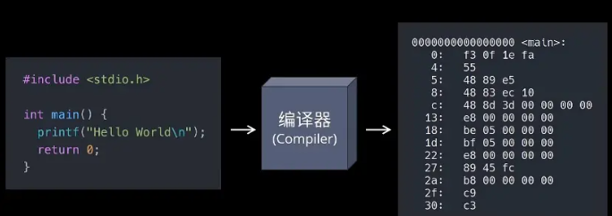

# 编译

[TOC]

## 1. 编译与链接

##### 可执行程序

* 双击后就可以直接运行的程序，这样的程序被称为可执行程序（Executable Program）

  在 Windows 下，可执行程序的后缀有`.exe`和`.com`（其中`.exe`比较常见）。在类 UNIX 系统（Linux、Mac OS 等）下，可执行程序没有特定的后缀，系统根据文件的头部信息来判断是否是可执行程序。

* 可执行程序的内部是一系列二进制形式的计算机指令和数据的集合，CPU 可以直接识别，但是对于程序员，它们非常晦涩。

  * 屏幕上C语言输出：
  
    ```C
    puts("VIP会员");
    ```

  * 使用指令输出：
  
    
  
  在计算机发展的初期，程序员就是使用这样的二进制指令来编写程序的，但频繁查询指令手册，效率低下难以排查错误。这就倒逼程序员开发出了编程语言，提高自己的生产力，例如汇编、C语言、Java、Python、Go语言等，都是在逐步提高开发效率


##### 编译(Compile)

* 编译器

  C语言代码由固定的词汇按照固定的格式组织起来，简单直观，程序员容易识别和理解，但是对于CPU，C语言代码就是天书，根本不认识，CPU只认识几百个二进制形式的指令。这就需要一个工具，将C语言代码转换成CPU能够识别的二进制指令，也就是将代码加工成 .exe 程序的格式；这个工具是一个特殊的软件，叫做**编译器（Compiler）。**

* 编译

  编译器能够识别代码中的词汇、句子以及各种特定的格式，并将他们转换成计算机能够识别的二进制形式，这个过程称为**编译（Compile）**。

  

  它是一个复杂的过程，大致包括词法分析、语法分析、语义分析、性能优化、生成可执行文件五个步骤，期间涉及到复杂的算法和硬件架构。

  你的代码语法正确与否，编译器说了才算，我们学习C语言，从某种意义上说就是学习如何使用编译器。

  编译器可以 100% 保证你的代码从语法上讲是正确的，因为哪怕有一点小小的错误，编译也不能通过，编译器会告诉你哪里错了，便于你的更改。

  **编译永远都是以单个源文件为单位的**：在实际开发中，我们通常会将不同功能的代码分散到不同的源文件，一方面方便代码的阅读和维护，同时也提升了软件构建的速度。

  > 比如，我们修改了其中某一个源文件，那么只需要单独编译它这一个文件即可，不需要浪费时间重新编译整个工程。

  ```C++
  //main.c
  #include <stdio.h>
  
  int add(int a, int b);
  
  int main() {
      printf("Hello World!\n");
      int result = add(5, 5);
      return 0;
  }
  ```

  ```c++
  //test.c
  
  int add(int a, int b) {
      return a + b;
  }
  ```

  ```shell
  # 例如工程包含两个.c文件main.c和test.c，需要编译两次
  gcc -c main.c
  gcc -c test.c
  ```

* 二进制目标文件：

  执行上述命令后，会生成两个二进制的扩展名为 `.o` 的文件，它们被称作目标文件。

  目标文件是一个二进制的文件，文件的格式是 `ELF(Executable and Linkable Format)`，Linux 下所有可执行文件的通用格式。相应的 Windows 使用的是另一种格式 `PE`，它们虽然互不兼容，但在结构上非常相似，都是对二进制代码的一种封装。

  我们可以在文件头部找到可执行文件的基本信息，比如支持的操作系统、计器类型等等，执行以下命令查看：

  ```shell
  readelf -h main.o
  # 输出结果
  ELF 头：
    Magic：   7f 45 4c 46 02 01 01 00 00 00 00 00 00 00 00 00 
    类别:                              ELF64
    数据:                              2 补码，小端序 (little endian)
    版本:                              1 (current)
    OS/ABI:                            UNIX - System V
    ABI 版本:                          0
    类型:                              REL (可重定位文件)
    系统架构:                          Advanced Micro Devices X86-64
    版本:                              0x1
    入口点地址：               0x0
    程序头起点：          0 (bytes into file)
    Start of section headers:          744 (bytes into file)
    标志：             0x0
    本头的大小：       64 (字节)
    程序头大小：       0 (字节)
    Number of program headers:         0
    节头大小：         64 (字节)
    节头数量：         13
    字符串表索引节头： 10
  ```

  文件后面则是一系列的区块，里面有我们的计器代码还有程序的数据等等，查看区块/段(Sections)：

  ```shell
  readelf -S main.o
  # 输出结果
  共有 13 个节头，从偏移量 0x2e8 开始：
  
  节头：
    [号] 名称              类型             地址              偏移量
         大小              全体大小          旗标   链接   信息   对齐
    [ 0]                   NULL             0000000000000000  00000000
         0000000000000000  0000000000000000           0     0     0
    [ 1] .text             PROGBITS         0000000000000000  00000040
         000000000000002b  0000000000000000  AX       0     0     1
    [ 2] .rela.text        RELA             0000000000000000  00000220
         0000000000000048  0000000000000018   I      11     1     8
    [ 3] .data             PROGBITS         0000000000000000  0000006b
         0000000000000000  0000000000000000  WA       0     0     1
    [ 4] .bss              NOBITS           0000000000000000  0000006b
         0000000000000000  0000000000000000  WA       0     0     1
    [ 5] .rodata           PROGBITS         0000000000000000  0000006b
         000000000000000d  0000000000000000   A       0     0     1
    [ 6] .comment          PROGBITS         0000000000000000  00000078
         0000000000000036  0000000000000001  MS       0     0     1
    [ 7] .note.GNU-stack   PROGBITS         0000000000000000  000000ae
         0000000000000000  0000000000000000           0     0     1
    [ 8] .eh_frame         PROGBITS         0000000000000000  000000b0
         0000000000000038  0000000000000000   A       0     0     8
    [ 9] .rela.eh_frame    RELA             0000000000000000  00000268
         0000000000000018  0000000000000018   I      11     8     8
    [10] .shstrtab         STRTAB           0000000000000000  00000280
         0000000000000061  0000000000000000           0     0     1
    [11] .symtab           SYMTAB           0000000000000000  000000e8
         0000000000000120  0000000000000018          12     9     8
    [12] .strtab           STRTAB           0000000000000000  00000208
         0000000000000016  0000000000000000           0     0     1
  Key to Flags:
    W (write), A (alloc), X (execute), M (merge), S (strings), l (large)
    I (info), L (link order), G (group), T (TLS), E (exclude), x (unknown)
    O (extra OS processing required) o (OS specific), p (processor specific)
  ```

  > 在以上信息中，经常提到有：
  >
  > - `.text` 代码区，里面是之前编译好的机器代码；
  > - `.data` 数据区，里面保存了我们初始化的全局变量、局部静态变量等等；

  目标文件虽然包含了编译之后的机器代码，但它并不能够直接执行，操作系统也不允许你区执行它。因为我们在编译的过程中，用到了尚未定义的 `add()` 函数。

  在主程序中 `add()` 其实只是一句声明而已，它被定义在另一个模块 `math.c` 中，这同样也包括我们用到的标准库中的 `printf()` 函数，如果我们去查看 `stdio.h` 头文件，其中的 `printf()` 也只是一个函数声明而已。

  换句话说，我们在编译 `main.c` 时，编译器完全不知道 `printf()` 和 `add()` 函数的存在，比如它们位于内存的哪个区块、代码长什么样，都是不知道的。因此编译器只能将这个两个函数的跳转地址暂时先设为 0，随后在链接的时候再去修正它。


##### 链接(Link)

* 目标文件

  C语言代码经过编译以后，并没有生成最终的可执行文件（.exe 文件），而是生成了一种叫做**目标文件（Object File）**的中间文件（或者说临时文件）。

  目标文件也是二进制形式的，它和可执行文件的格式是一样的。对于 Visual C++，目标文件的后缀是`.obj`；对于 GCC，目标文件的后缀是`.o`。

  目标文件经过链接（Link）以后才能变成可执行文件。既然目标文件和可执行文件的格式是一样的，为什么还要再链接一次呢，直接作为可执行文件不行吗？

  不行的！因为编译只是将我们自己写的代码变成了二进制形式，它还需要和系统组件（比如标准库、动态链接库等）结合起来，这些组件都是程序运行所必须的。

* 链接

  **链接（Link）**其实就是一个“打包”的过程，它将所有二进制形式的目标文件和系统组件组合成一个可执行文件。完成链接的过程也需要一个特殊的软件，叫做**链接器（Linker）**。

  随着我们学习的深入，我们编写的代码越来越多，最终需要将它们分散到多个源文件中，**编译器每次只能编译一个源文件，生成一个目标文件**，这个时候，链接器除了将目标文件和系统组件组合起来，还需要**将编译器生成的多个目标文件组合起来**。

  再次强调，**编译是针对一个源文件的，有多少个源文件就需要编译多少次，就会生成多少个目标文件。**
  
  > 例如，main.c，test.c，这两个源文件需要编译两次，分别编译成main.o和test.o，再通过链接将main.o和test.o生成可执行文件main.out
  
  将编译生成的 `main.o` 和 `test.o` 链接生成一个独立的可执行文件，命令如下：
  
  ```bash
  gcc main.o test.o -o demo
  ```
  
  执行完成后，在终端目录下，我们可以找到生成的 demo 文件，该文件可以直接运行。
  
  ```bash
  ./demo
  ```
  
  输出结果：
  
  ```bash
  Hello World!
  ```
  
  **链接其实将编译之后的所有目标文件，连同用到的一些静态库、运行时库（动态库）组合拼装成一个独立的可执行文件。**其中就包括我们之前提到的地址修正。链接器会根据目标文件或者静态库中的重定位表，找到那些需要被重定位的函数、全局变量，从而修正它们的地址。
  
  > 如果我们在链接的时候忘记提供必须的目标文件，比如这里的 `math.o` 由于链接器找不到 `add()` 函数的实现，就会报错"引用未定义"(undefined reference to 'xxx')，或者有的编译器也叫"符号未定义"(undefined symbols to 'xxx')，意思就是我们的代码中用到了 `xxx`，但链接器却无法找到它的定义。
  >
  > ```bash
  > gcc main.o -o demo
  > ```
  >
  > 输出结果：
  >
  > ```bash
  > main.o：在函数‘main’中：
  > main.c:(.text+0x1d)：对‘add’未定义的引用
  > collect2: error: ld returned 1 exit status
  > ```


##### 总结

不管我们编写的代码有多么简单，都必须经过**「编译 --> 链接」**的过程才能生成可执行文件：

- 编译就是将我们编写的源代码“翻译”成计算机可以识别的二进制格式，它们以目标文件的形式存在；
- 链接就是一个“打包”的过程，它将所有的目标文件以及系统组件组合成一个可执行文件。


## 2. GCC、gcc与g++

##### 基本概念

* **GCC**：GNU Compiler Collection(GUN 编译器集合)，它可以编译C、C++、JAV、Fortran、Pascal、Object-C、Ada等语言

  > 在早期，GCC为**GNU C Compiler**的简写，即GNU计划中的C语言编译器。 但经过多年的扩展和迭代，GCC逐渐支持C、C++、Objective-C、Fortran、Java、Ada和Go等越来越多语言的编译。 因此，其GCC被重新定义为**GNU Compiler Collection**，即 GNU编译器套件。

* **gcc**：GCC中的GUN C Compiler（C 编译器）

* **g++**：GCC中的GUN C++ Compiler（C++编译器）


##### gcc编译步骤

* 本质而言，gcc和g++并不是编译器，也不是编译器的集合，它们只是一种驱动器，根据参数中要编译的文件的类型，调用对应的GUN编译器而已。

* 比如，用gcc编译一个c文件的话，包含**预处理**、**编译**、**汇编**、**链接**等四个步骤：

  ```C
  Step1：Call a preprocessor, like cpp.
  Step2：Call an actual compiler, like cc or cc1.
  Step3：Call an assembler, like as.
  Step4：Call a linker, like ld
      
  //以输入C语言程序源码文件b.c为例，直接调用命令gcc b.c，将会完整执行以下流程，并生成对应的可执行的二进制文件a.out:    
        -E          -S          -c          
  b.c ------> b.i ------> b.s ------> b.o ------> a.out
        gcc         gcc         as          ld
  //汇编由工具as完成，链接则由工具ld完成
  ```

  > 对`gcc`使用以下指令，将会使其编译流程**停止**在对应位置：
  >
  > - `-E`，（pr**E**processing），执行到**预处理**步骤之后，即处理C/C++源码中`#`开头的指令，包括**宏展开**以及`#include`**头文件引入**等等。 该指令默认不输出文件，可以使用`-o`指令输出约定后缀为`*.i`的文件。
  > - `-S`，（a**S**sembly），执行到**编译**步骤之后，生成汇编文件，但不生成二进制机器码。 该指令默认的输出文件后缀为`*.s`。
  > - `-c`，（**c**ompilation），执行到**汇编**步骤之后，调用工具`as`，从汇编码生成二进制机器码，但不进行链接。 该指令默认的输出文件后缀为`*.o`（**o**bject）。
  > - 不带以上参数调用`gcc`将会完整执行以上流程，即执行到到**链接**（linking）步骤之后。 链接步骤实际上调用链接工具`ld`来执行，会将源码生成的二进制文件，库文件，以及程序的启动部分进行组合，从而形成一个完整的二进制可执行文件。
  > - 特别的，使用指令`-o`，（**o**utput），可以指定输出文件的名称。 例如`gcc b.c -o b.bin`，将生成可执行文件`b.bin`，而不是默认的`a.out`。

* 由于编译器是可以更换的，所以gcc不仅仅可以编译C文件

* 更准确的说法是：**gcc调用了C compiler，而g++调用了C++ compiler**


##### gcc与g++的主要区别

1. 对于 .c和.cpp文件，gcc分别当做c和cpp文件编译（c和cpp的语法强度是不一样的）

2. 对于 .c和.cpp文件，g++则统一当做cpp文件编译

3. 使用g++编译文件时，g++会自动链接标准库STL，而gcc不会自动链接STL

4. gcc在编译C文件时，可使用的预定义宏是比较少的

5. gcc在编译cpp文件时/g++在编译c文件和cpp文件时（这时候gcc和g++调用的都是cpp文件的编译器），会加入一些额外的宏，这些宏如下：

   ```C
   #define __GXX_WEAK__ 1
   #define __cplusplus 1
   #define __DEPRECATED 1
   #define __GNUG__ 4
   #define __EXCEPTIONS 1
   #define __private_extern__ extern
   ```


##### 误区

* 误区一：gcc只能编译C代码，g++只能编译C++代码。
  两者都可以，但请注意：

  （1）后缀为.c的，gcc把它当作是C程序，而g++当作是c++程序；后缀为.cpp的，两者都会认为是C++程序，注意，虽然C++是C的超集，但是两者对语法的要求是有区别的。C++的语法规则更加严谨一些。
  （2）编译阶段，g++会调用gcc，对于C++代码，两者是等价的，但是因为gcc命令不能自动和C++程序使用的库联接，所以通常用g++来完成链接，为了统一起见，干脆编译/链接统统用g++了，这就给人一种错觉，好像cpp程序只能用g++似的。

* 误区二：gcc不会定义__cplusplus宏，而g++会

  实际上，这个宏只是标志着编译器将会把代码按C还是C++语法来解释，如上所述，如果后缀为.c，并且采用gcc编译器，则该宏就是未定义的，否则，就是已定义。

* 误区三：编译只能用gcc，链接只能用g++

  严格来说，这句话不算错误，但是它混淆了概念，应该这样说：编译可以用gcc/g++，而链接可以用g++或者gcc -lstdc++。因为gcc命令不能自动和C++程序使用的库联接，所以通常使用g++来完成联接。但在编译阶段，g++会自动调用gcc，二者等价。

 

## 3. Make与Cmake

当工程中包含的源文件很多，每次都手动编译再链接显然不够高效，实际开发也没有人会这么做，通常我们都是用各种各样的 IDE 或者构建工具帮我们自动化整个流程。


##### make

写程序大体步骤为：

1.用编辑器编写源代码，如.c文件。

2.用编译器编译代码生成目标文件，如.o。

3.用链接器连接目标代码生成可执行文件，如.exe。

但如果源文件太多，一个一个编译时就会特别麻烦，于是人们想到，为什么不设计一种类似批处理的程序，来批处理编译源文件呢，于是就有了make工具，它是一个自动化编译工具，你可以使用一条命令实现完全编译。但是你需要编写一个规则文件，make依据它来批处理编译，这个文件就是makefile，所以编写makefile文件也是一个程序员所必备的技能。

* Makefile 的核心是**对"依赖"的管理**，比如要构建上文中的可以执行程序 `demo`，则需要 `main.o` 和 `test.o` 文件同时执行 gcc 链接指令，构建 `main.o` 又需要 `main.c` 这个文件同时执行 gcc 编译命令，依此类推，我们可以发现，**makefile其实就是在定义一棵依赖树**。

  ```ascii
  main.c ---编译---> main.o --┐
                             |---链接---> program
  test.c ---编译---> test.o --┘
  ```

* makefile代码如下：

  ```make
  all: demo
  
  demo: main.o math.o
                  gcc main.o math.o -o demo
  
  main.o: main.c
                  gcc -c main.c
  
  math.o: math.c
                  gcc -c math.c
  
  clean:
                  rm demo main.o math.o
  ```

  * 我们调用make命令跟上目标名称demo，就会自动根据依赖树去构建这个可执行文件

    ```bash
    make demo
    ```

  * 构建之后，如果没有更新文件内容，重新运行就会提示文件已存在且是最新的，不会重新构建

    ```bash
    make: 'demo' is up to date.
    ```

    

##### cmake

对于一个大工程，编写makefile实在是件复杂的事，于是人们又想，为什么不设计一个工具，读入所有源文件之后，自动生成makefile呢，于是就出现了cmake工具，它能够输出各种各样的makefile或者project文件,从而帮助程序员减轻负担。但是随之而来也就是编写cmakelist文件，它是cmake所依据的规则。


##### 编译工具链

C/C++项目的构建编译常用工具链：GCC，Make，以及CMake。

 其中，GCC是C/C++语言的编译工具，Make是增量式（编译）批处理工具，CMake是Make脚本生成工具。 在现代C/C++项目的构建中，它们的关系如下。

```C
              cmake           make       gcc
CMakelist.txt -----> Makefile ----> Cmds ---> Binary
```

开发者需要编写`CMakelist.txt`文件，来配置项目相关的CMake参数。 通过运行`cmake`命令，自动生成对应平台的Make工具自动构建脚本`Makefile`文件。

使用Make工具来编译C/C++项目时，一般会使用Shell命令来调用`gcc`，**自动化**且**增量式**地实现C/C++源代码的编译链接等一系列工作。


## 4. 交叉编译

##### 本地编译

本地编译可以理解为，在当前编译平台下，编译出来的程序只能放到当前平台下运行。平时我们常见的软件开发，都是属于本地编译：

比如，我们在 x86 平台上，编写程序并编译成可执行程序。这种方式下，我们使用 x86 平台上的工具，开发针对 x86 平台本身的可执行程序，这个编译过程称为本地编译。


##### 交叉编译

交叉编译可以理解为，在当前编译平台下，编译出来的程序能运行在体系结构不同的另一种目标平台上，但是编译平台本身却不能运行该程序：

比如，我们在 x86 平台上，编写程序并编译成能运行在 ARM 平台的程序，编译得到的程序在 x86 平台上是不能运行的，必须放到 ARM 平台上才能运行。


##### Why交叉编译

需要交叉编译的原因：

* Speed： 目标平台的运行速度往往比主机慢得多，许多专用的嵌入式硬件被设计为低成本和低功耗，没有太高的性能
* Capability： 整个编译过程是非常消耗资源的，嵌入式系统往往没有足够的内存或磁盘空间
* Availability： 即使目标平台资源很充足，可以本地编译，但是第一个在目标平台上运行的本地编译器总需要通过交叉编译获得
* Flexibility： 一个完整的Linux编译环境需要很多支持包，交叉编译使我们不需要花时间将各种支持包移植到目标板上

交叉编译的困难点：

* 不同的体系架构拥有不同的机器特性

  > **Word size：** 是64位还是32位系统
  >
  > **Endianness：** 是大端还是小端系统
  >
  > **Alignment：** 是否必修按照4字节对齐方式进行访问
  >
  > **Default signedness：** 默认数据类型是有符号还是无符号
  >
  > **NOMMU：** 是否支持MMU

* 交叉编译时的主机环境与目标环境不同

  > **Configuration issues：**
  >
  > **HOSTCC vs TARGETCC：**
  >
  > **Toolchain Leaks：**
  >
  > **Libraries：**
  >
  > **Testing：**


##### 交叉编译链

编译过程是按照不同的子功能，依照先后顺序组成的一个复杂的流程：


编译过程包括了预处理、编译、汇编、链接等功能。既然有不同的子功能，那每个子功能都是一个单独的工具来实现，它们合在一起形成了一个完整的工具集。

同时编译过程又是一个有先后顺序的流程，它必然牵涉到工具的使用顺序，每个工具按照先后关系串联在一起，这就形成了一个链式结构。

因此，**交叉编译链**就是为了编译跨平台体系结构的程序代码而形成的由多个子工具构成的一套完整的工具集。同时，它隐藏了预处理、编译、汇编、链接等细节，当我们指定了源文件(.c)时，它会自动按照编译流程调用不同的子工具，自动生成最终的二进制程序映像(.bin)。


## 5. 静态库与动态库

##### 库的概念

1. 库是一个二进制可执行的文件；（存储功能函数）
2. 库需要被载入到内存中使用；
3. 比较于二进制程序，库是不能单独运行的；
4. 每个操作系统都有自己的库，不兼容；
5. 库是已经写好的，成熟的，可以复用的功能代码，我们写的很多代码都是依赖于基础库；
6. 提高代码移植效率，可以不用移植源码，直接移植库即可；

|        | windows | linux     |
| :----- | :------ | --------- |
| 静态库 | *.lb    | libxxx.a  |
| 动态库 | *.lld   | libxxx.so |


##### 静态库

1. `libxxx.a`格式命名：以`lib`开头，后面跟库名，以`.a`结尾，如`libxxx.a`中`xxx`才是库名

2. 用静态库封装功能函数，在程序编译到**链接库**步骤，将静态库函数**继承**到二进制文件中，最终生成一个可执行二进制程序；

3. 优点：程序运行的时候，与静态库没有任何关系，可以完全脱离静态库，方便移植；

4. 缺点：

   * 在程序编译的时候，直接将静态库继承到可执行程序中，因此可执行程序比较大；
   * 程序在运行的时候占用内存大，存储的时候占用磁盘大；
   * 程序的更新部署比较麻烦；

5. 制作：

   ```shell
   gcc -c func.c -o func.o	     # 一步完成预处理、编译、汇编步骤
   ar -crs libfunc.a func.o     # 生成静态库，且库的名字是func
   #有多个.o文件的时候
   ar -crs libfunc.a func.o func1.o func2.o func3.o
   ```

6. 使用步骤：

   ```shell
   gcc main.c -L库的路径 -l库的名字            //默认生成一个a.out二进制程序
   gcc main.c -L./ -lfunc
   
   gcc main.c -o main -L库的路径 -l库的名字    //生成一个main二进制程序
   gcc main.c -o main -L./ -lfunc
   ```


##### 动态库

1. `libxxx.so`格式命名：以`lib`开头，后面跟库名，以`.so`结尾，如`libxxx.so`中`xxx`才是库名

2. 可执行程序编译的时候，不会链接到动态库，而是在程序执行的到库函数的时候，会去找动态库中的相关函数：

   * 如果内存中不存在该动态库，则会将动态库加载到内存中
   * 如果内存中已经存在该动态库，则直接调用动态库，因此内存中最多只有一份

3. 优点：可执行程序运行的时候，节省内存空间；程序存储的时候，节省磁盘空间；

4. 缺点：

   * 程序运行的时候，如果没有找到动态库，则会导致程序崩溃；

5. 制作：

   ```shell
   gcc -Wall  -fPIC -c func.c -o func.o    # 一步完成预处理、编译、汇编步骤
   gcc -shared -o libfunc.so func.o        # 生成动态库，且库的名字是func
   
   # 如果有多个.o文件的时候
   gcc -shared -o libfunc.so func.o func1.o func2.o func3.o
   ```

6. 使用步骤：

   ```shell
   gcc main.c -L库的路径 -l库的名字            # 默认生成一个a.out二进制程序
   gcc main.c -L./ -lfunc
   
   gcc main.c -o main -L库的路径 -l库的名字    # 生成一个main二进制程序
   gcc main.c -o main -L./ -lfunc
   ```

7. 配置环境变量：

   * 将动态库移动到`/lib`或者`/usr/lib/`目录下

   ```shell
   sudo mv libfunc.so /lib/
   # 或者
   sudo mv libfunc.so /usr/lib/
   ```

   * 其他方法


## 参考

1. [C语言编译和链接详解（通俗易懂，深入本质）](http://c.biancheng.net/view/1736.html)
2. [GCC与gcc，g++区别](https://blog.csdn.net/weixin_39303983/article/details/118671256)
3. [GCC/Make/CMake 之 GCC](https://zhuanlan.zhihu.com/p/342151242)
4. [CMake与Make最简单直接的区别](https://blog.csdn.net/weixin_42491857/article/details/80741060)
5. [交叉编译详解 一 概念篇](https://blog.csdn.net/pengfei240/article/details/52912833)
6. [动态库和静态库](https://blog.csdn.net/xyx340521/article/details/123623551)
